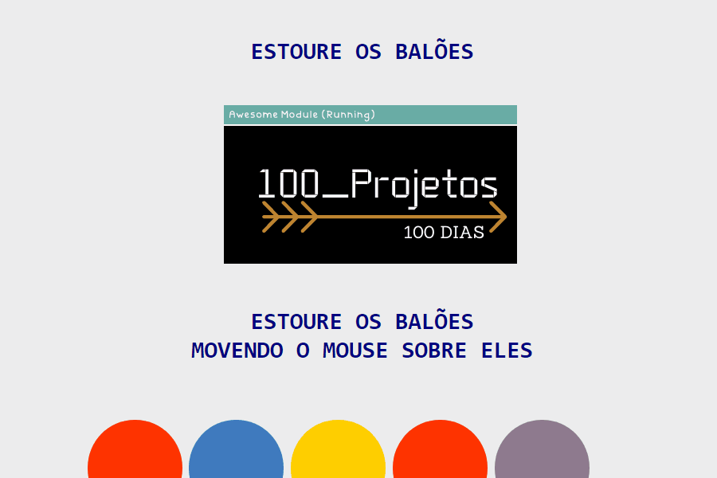

<h1 align="center">100 Projetos de Front-End</h1>

<h2> 🏆 Balões Interativos</h2>

 💻 O projeto consiste em criar balões que quando passado
o mouse por cima o mesmo estoure, criando assim uma animação simples.

<h2> 🚀 Tecnologias Utilizadas</h2>
<h3>

 🈠HTML

 🈠CSS

 🈠Javascript

</h3>
<h2> 📺 Preview</h2>

<h2> ♟ Objetivo</h2>

O objetivo é construir todo os dias durante 100 dias 01 projeto simples de front end usando somente HTML, CSS e Javascript. Assim posso consolidar o conhecimento e criar o meu portfólio. A intenção é sempre melhorar o que foi feito e futuramente adicionar novas tecnologias.

